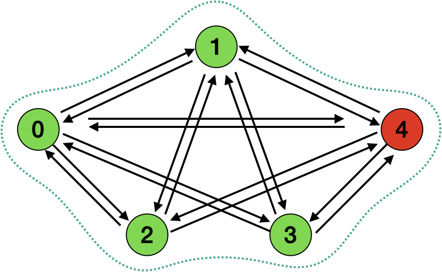
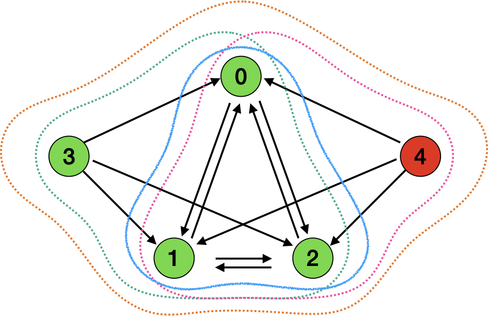
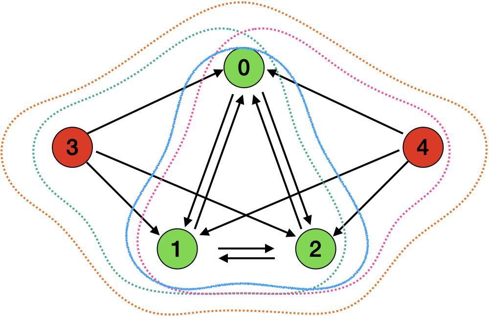
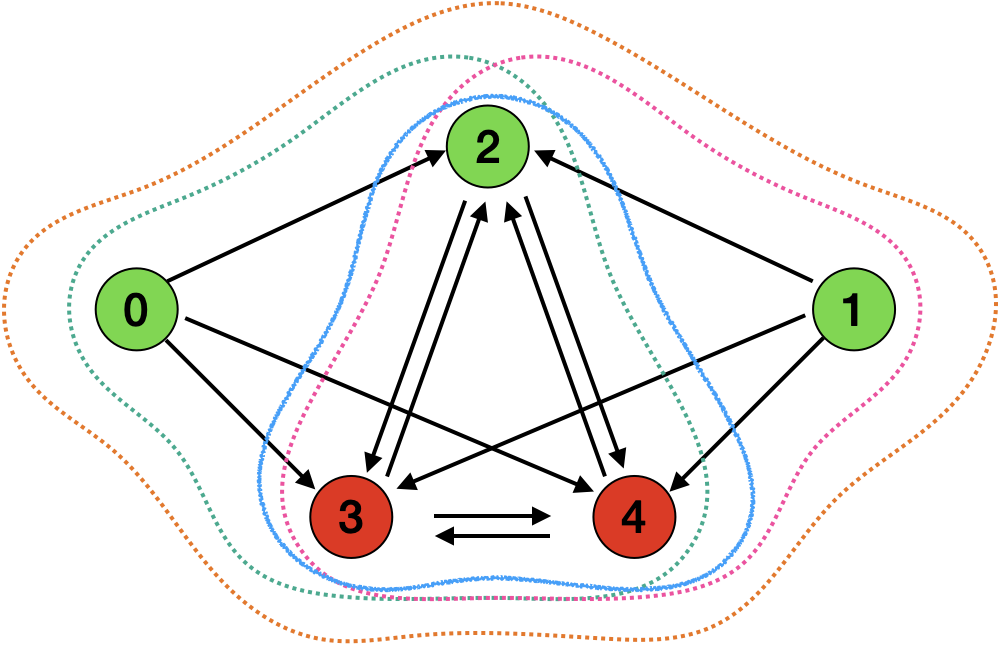
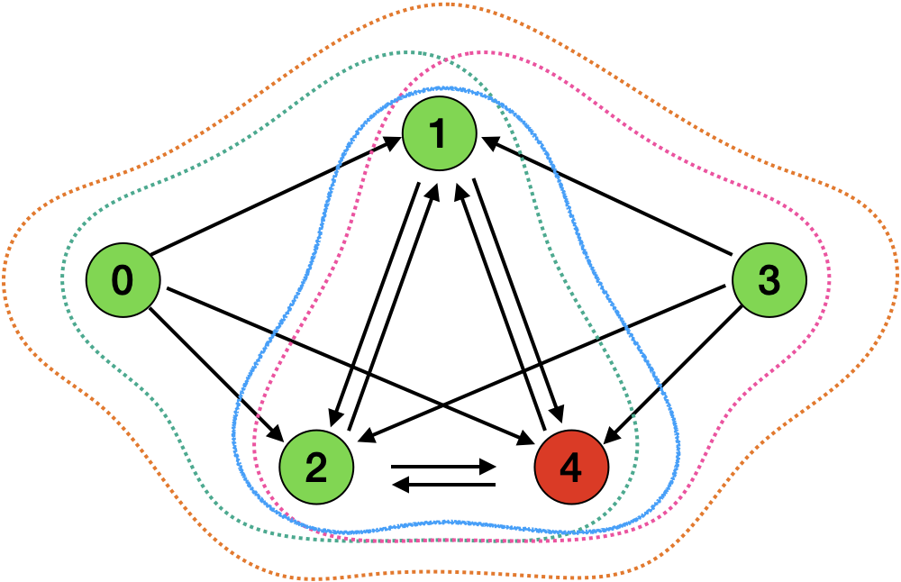
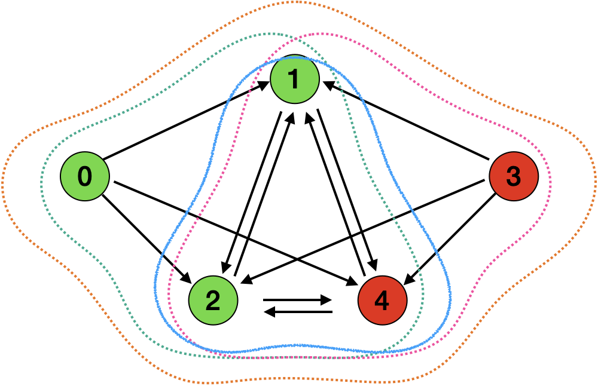

## Single Quorum

```cpp

    {{{0, {0, 1, 2, 3, 4}},
      {0, {0, 1, 2, 3, 4}},
      {0, {0, 1, 2, 3, 4}},
      {0, {0, 1, 2, 3, 4}},
      {0, {0, 1, 2, 3, 4}}}};

```


## Multiple quorums variations

**UPPAAL Quorum Set Code 1 for config 1, 4**
```cpp
    {{{0, {0, 1, 2, N, N}}, // 0
      {0, {0, 1, 2, N, N}}, // 1
      {0, {0, 1, 2, N, N}}, // 2
      {0, {0, 1, 2, 3, N}}, // 3
      {0, {0, 1, 2, N, 4}}}}; // 4
```

for



**UPPAAL Quorum Set Code 2 for config 5**
```cpp
    {{{0, {0, N, 2, 3, 4}}, // 0
      {0, {N, 1, 2, 3, 4}}, // 1
      {0, {N, N, 2, 3, 4}}, // 2
      {0, {N, N, 2, 3, 4}}, // 3
      {0, {N, N, 2, 3, 4}}}}; // 4
```
for


**UPPAAL Quorum Set Code 3 for config 2, 3**
```cpp
    {{{0, {0, 1, 2, N, 4}}, // 0
      {0, {N, 1, 2, N, 4}}, // 1
      {0, {N, 1, 2, N, 4}}, // 2
      {0, {N, 1, 2, 3, 4}}, // 3
      {0, {N, 1, 2, N, 4}}}}; // 4
```

for

